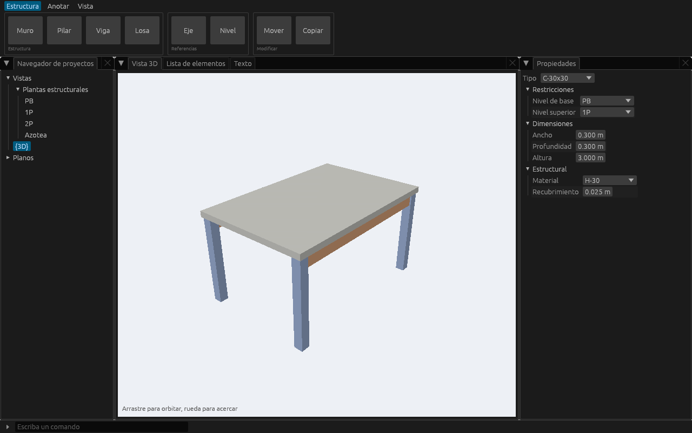

# UI toolkit spike (#4)

Throwaway prototype for [spike #4](https://github.com/hito-project/hito/issues/4). It builds the riskiest needs from [ADR 0007](../../docs/decisions/0007-ui-familiar-to-current-users.md) with egui 0.36, eframe and wgpu 30. The comparison of toolkits is in the "UI toolkit evaluation" Research discussion. The decision is in `docs/decisions/0015-ui-toolkit.md`.

This code isn't part of HITO and won't be merged.



## What it covers

| Need | Where | How it's checked |
|---|---|---|
| Ribbon with tabs and groups | `src/lib.rs`, `ribbon` | `ribbon_button_is_accessible_and_runs_its_command` |
| Dockable panels | `egui_dock` 0.21 in `src/lib.rs` | Screenshot; drag tabs by hand in `cargo run` |
| Property grid with units | `src/lib.rs`, `Panel::Properties` | `property_grid_values_are_named_for_screen_readers` |
| Command line with autocomplete, accent-insensitive, language-neutral names | `src/lib.rs`, `command_line`; `src/commands.rs` | `command_line_autocompletes_and_runs`, `accent_insensitive_completion` |
| Revit-style two-letter shortcuts | `src/lib.rs`, `shortcuts` | `two_letter_shortcuts_when_nothing_has_focus` |
| Embedded wgpu 3D viewport with its own depth buffer, in a dock tab | `src/viewport.rs` | `viewport_renders_with_wgpu_inside_a_dock_tab` (renders with a real GPU and orbits) |
| A list of 100,000 elements | `Panel::Elements` | Scroll it in `cargo run` |
| i18n with Fluent, switching language at runtime | `src/i18n.rs`, `i18n/*.ftl` | `language_switch_relabels_everything` |
| Text shaping: Spanish, Hebrew, Arabic, mixed direction | `src/text.rs` | `text_shaping_report`, `text_shaping_screenshot` |
| Accessibility | All tests drive the app through the AccessKit tree | `finding_dock_tabs_have_no_accessible_name` records a gap |

## Running

Rust isn't installed system-wide, so commands go through nix. wgpu and winit load Vulkan, Wayland, X11 and xkbcommon at runtime, so on NixOS put them on the library path first:

```sh
source nix-env.sh
nix shell nixpkgs#cargo nixpkgs#rustc nixpkgs#gcc -c cargo run
nix shell nixpkgs#cargo nixpkgs#rustc nixpkgs#gcc -c cargo test -- --test-threads=1
```

Tests need a Vulkan device (a GPU, or Mesa's lavapipe). Run them on one thread: several wgpu devices created in parallel crashed the test process on this machine.

The Hebrew and Arabic samples need a font for those scripts. The prototype looks for IBM Plex Sans Arabic/Hebrew or Noto Sans Arabic/Hebrew with `fc-match`.

## Results

`results/` holds the output of the last run:

- `screenshot.png`: the window, rendered headless with wgpu.
- `text-shaping.png` and `text-shaping.tsv`: the text samples and their glyph counts.
